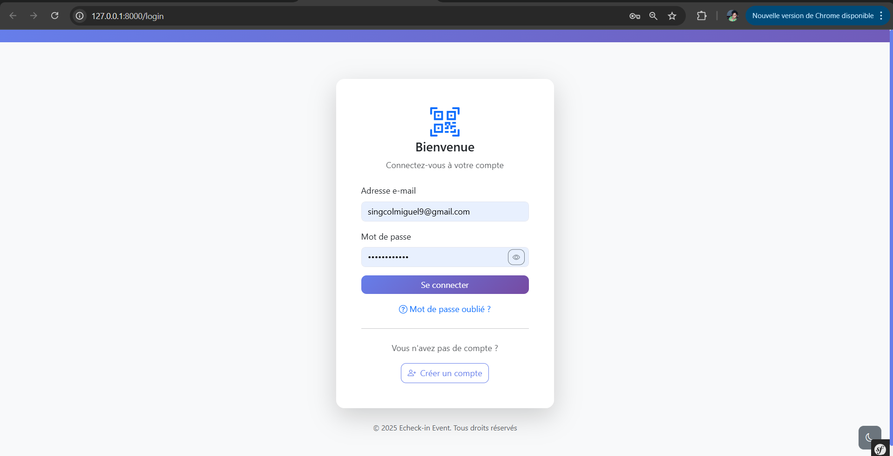
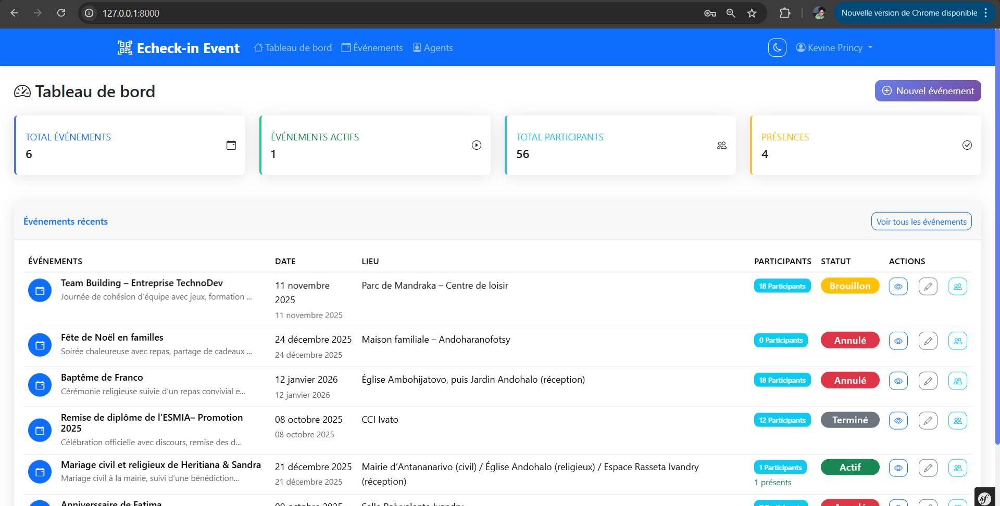
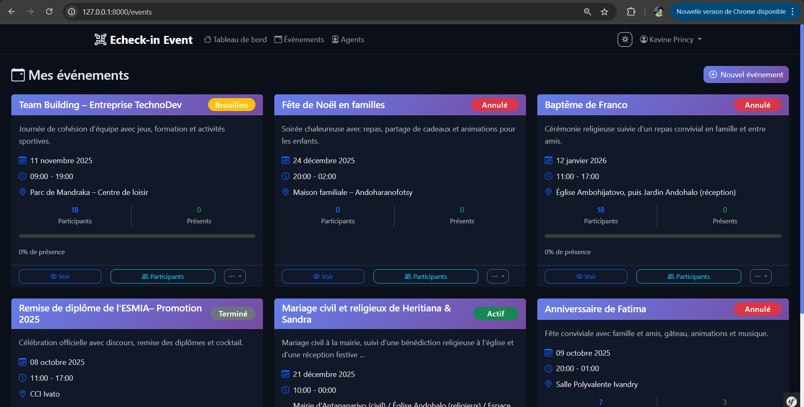
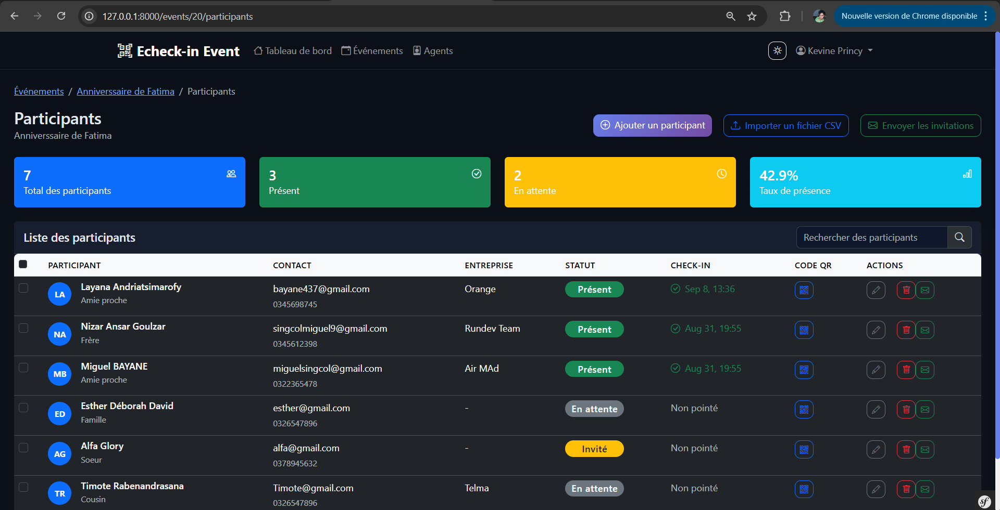
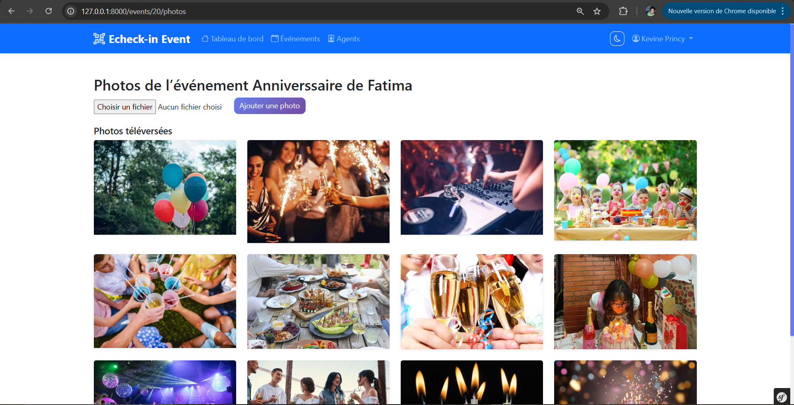
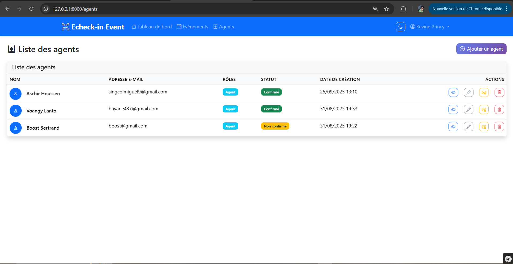
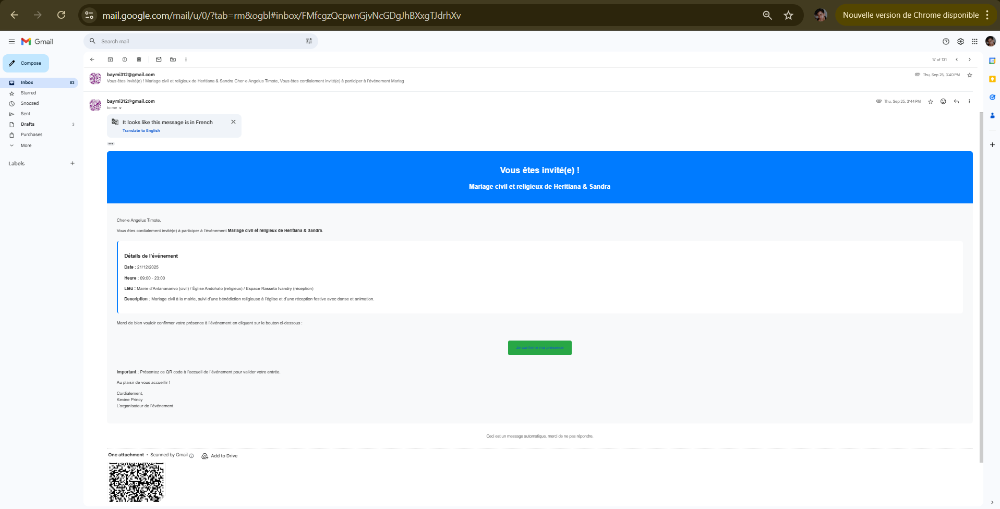
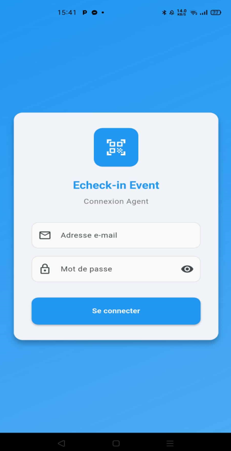
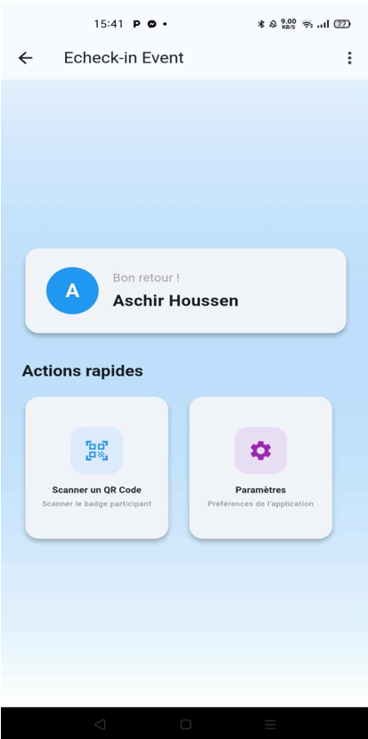
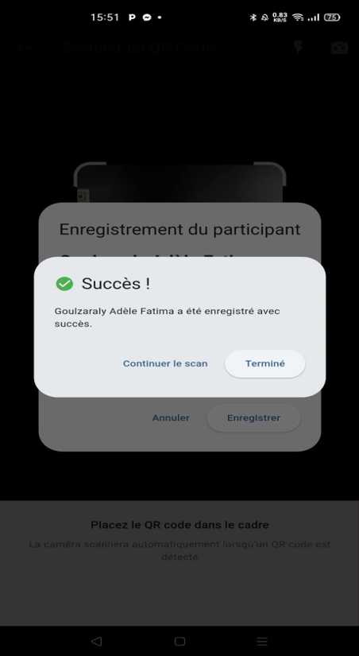

# 🎫 Echeck-in Event - Système de Gestion d'Événements

## 📋 Description
Solution numérique complète pour la gestion d'événements avec invitations électroniques, QR codes uniques, et contrôle d'accès mobile. Développé dans le cadre d'un stage de 3 mois.

## 🖼️ Aperçu du projet

### 01 – Page de connexion (Login)


### 02 – Dashboard organisateur


### 03 – Liste des événements


### 04 – Gestion des participants


### 05 – Galerie photos d’un événement


### 06 – Gestion des agents


### 07 – Email d’invitation avec QR code


### 08 – Application mobile – Connexion


### 09 – Application mobile – Accueil


### 10 – Application mobile – Scan QR


*Toutes les captures ci-dessus proviennent du dossier [screenshots/](screenshots/)*

## 🏗️ Architecture Technique

### **Backend Web**
- **Framework** : Symfony 6.x (PHP 8)
- **Base de données** : MySQL 8.0
- **API REST** : Symfony + Lexik JWT Bundle
- **Emails** : Symfony Mailer + SMTP Gmail
- **QR Codes** : Endroid QRCode Bundle

### **Application Mobile**
- **Framework** : Flutter
- **Fonctionnalités** : Scan QR, API REST, Authentification

### **Frontend Web**
- **Template Engine** : Twig
- **CSS Framework** : Bootstrap 5
- **JavaScript** : Vanilla JS + AJAX

## 👥 Rôles Utilisateurs

### 🎯 **Organisateur**
- Création et gestion d'événements
- Ajout de participants (manuel ou CSV)
- Envoi d'invitations avec QR codes
- Consultation des statistiques
- Export des données (CSV, PDF)

### 📱 **Agent de Contrôle**
- Application mobile dédiée
- Scan des QR codes d'invitation
- Validation en temps réel
- Synchronisation automatique

### 📧 **Invité**
- Réception d'email avec QR code unique
- Confirmation de présence
- Accès aux informations événement

## 🌟 Fonctionnalités Principales

### **Gestion d'Événements**
- ✅ Création/modification d'événements
- ✅ Définition date, lieu, type, description
- ✅ Upload d'images et galerie photos
- ✅ Gestion des menus et informations

### **Système d'Invitations**
- ✅ QR codes uniques et sécurisés
- ✅ Envoi automatique d'emails
- ✅ Templates d'emails personnalisables
- ✅ Relances automatiques

### **Contrôle d'Accès**
- ✅ Application mobile Flutter
- ✅ Scan QR code en temps réel
- ✅ Validation instantanée
- ✅ Prévention double scan

### **Tableau de Bord**
- ✅ Statistiques en temps réel
- ✅ Taux de participation
- ✅ Export CSV/Excel
- ✅ Rapports détaillés

## 🐳 Démarrage rapide avec Docker

Le projet web est **conteneurisé avec Docker** — démarrage en une seule commande.

### Prérequis
- [Docker Desktop](https://www.docker.com/products/docker-desktop/) installé

### Lancement
```bash
cd project_a_jour

docker compose up -d --build
# → http://localhost
```

### Architecture Docker
| Service | Technologie | Rôle |
|---|---|---|
| `nginx` | Nginx 1.25 | Reverse proxy + assets statiques |
| `backend` | PHP 8.2-FPM | API Symfony (multi-stage build) |
| `db` | MySQL 8.0 | Base de données |

Les migrations Doctrine et la génération des clés JWT s'exécutent **automatiquement** au premier démarrage.

### Commandes utiles
```bash
docker compose logs -f backend      # Voir les logs
docker compose exec backend bash    # Accéder au container
docker compose down                 # Arrêter
docker compose down -v              # Arrêter + supprimer les volumes
```

---

## ⚙️ Installation manuelle (sans Docker)

### Prérequis
- PHP 8.1+
- Composer
- MySQL 8.0+
- Node.js (pour assets)
- Flutter SDK (pour mobile)

### Backend (Symfony)
```bash
cd project_a_jour/backend

composer install
cp .env.example .env
# Modifiez DATABASE_URL dans .env

php bin/console lexik:jwt:generate-keypair
php bin/console doctrine:migrations:migrate
symfony server:start
```

### Application Mobile (Flutter)
```bash
cd project_a_jour/mobile_app
flutter pub get
flutter run
```

## 📊 Données de Démonstration

### Comptes de test
- **Organisateur** : admin@echeck-in.com / admin123
- **Agent** : agent@echeck-in.com / agent123

## 🎯 Cas d'Usage Réels

### **Événements Corporatifs**
- Conférences d'entreprise
- Formations professionnelles
- Séminaires et workshops

### **Événements Académiques**
- Soutenances de projets
- Conférences universitaires
- Cérémonies de remise de diplômes

### **Événements Sociaux**
- Mariages et réceptions
- Événements associatifs
- Festivals et concerts

## 📈 Métriques du Projet

### **Développement**
- **Durée** : 3 mois (stage professionnel)
- **Technologies** : 5+ (Symfony, Flutter, MySQL, etc.)
- **Fonctionnalités** : 15+ modules complets
- **Tests** : Unitaires et fonctionnels

### **Performance**
- **Scan QR** : < 2 secondes
- **Envoi emails** : Traitement par batch
- **API REST** : Authentification JWT sécurisée
- **Mobile** : Compatible Android/iOS

## 🔒 Sécurité

- ✅ **Authentification JWT** pour l'API
- ✅ **QR codes uniques** non falsifiables
- ✅ **Validation double scan** prévenue
- ✅ **CORS configuré** pour les domaines autorisés
- ✅ **Données sensibles** chiffrées

## 📄 Documentation

- [Cahier des charges complet](docs/cahier-des-charges.pdf)
- [Manuel utilisateur](docs/manuel-utilisateur.pdf)
- [Documentation technique](docs/documentation-technique.pdf)
- [Rapport de stage](docs/rapport-stage.pdf)

## 👨‍💻 Auteur

**Miguel Singcol (Bayane-max219)** - Développeur Full Stack
- **Stage** : 3 mois chez [Entreprise]
- **Encadrant** : Livarijaona Tafita Toussaints
- **Spécialisations** : Symfony, Flutter, MySQL, API REST

## 🏆 Réalisations Techniques

### **Innovation**
- Système QR code sécurisé unique
- Synchronisation temps réel mobile/web
- Architecture API REST complète

### **Impact Business**
- Digitalisation complète du processus
- Réduction des erreurs humaines
- Traçabilité totale des événements
- Gain de temps significatif

## 📄 Licence

Ce projet est sous licence MIT - voir le fichier [LICENSE](LICENSE) pour plus de détails.

## ⚠️ Note de Stage

Ce projet a été développé dans le cadre d'un stage professionnel de 3 mois. Il démontre :
- Capacité à gérer un projet complet
- Maîtrise des technologies modernes
- Respect des délais et cahier des charges
- Qualité professionnelle du code

---

**🎯 Projet de stage professionnel démontrant une expertise Full Stack complète avec des technologies modernes et des fonctionnalités avancées.**
